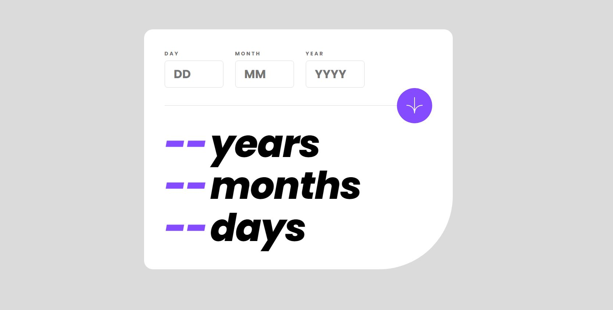
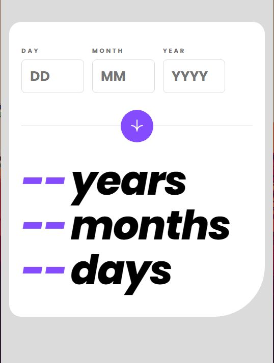

# Frontend Mentor - Age calculator app solution

This is a solution to the [Age calculator app challenge on Frontend Mentor](https://www.frontendmentor.io/challenges/age-calculator-app-dF9DFFpj-Q). Frontend Mentor challenges help you improve your coding skills by building realistic projects.

## Table of contents

- [Overview](#overview)
  - [The challenge](#the-challenge)
  - [Screenshot](#screenshot)
  - [Links](#links)
- [My process](#my-process)
  - [Built with](#built-with)
  - [What I learned](#what-i-learned)
  - [Continued development](#continued-development)
  - [Useful resources](#useful-resources)
- [Author](#author)

## Overview

Another Frontend Mentor challenge. This time creating an age calculator that takes in a date, does some validation/checks, and outputs how old that person is. With error handling of course.

### The challenge

Users should be able to:

- View an age in years, months, and days after submitting a valid date through the form
- Receive validation errors if:
  - Any field is empty when the form is submitted
  - The day number is not between 1-31
  - The month number is not between 1-12
  - The year is in the future
  - The date is invalid e.g. 31/04/1991 (there are 30 days in April)
- View the optimal layout for the interface depending on their device's screen size
- See hover and focus states for all interactive elements on the page

### Screenshot




### Links

- Solution URL: [https://github.com/jmmarketing/age-calculator-FEM](https://github.com/jmmarketing/age-calculator-FEM)
- Live Site URL: [https://jmmarketing.github.io/age-calculator-FEM/](https://jmmarketing.github.io/age-calculator-FEM/)

## My process

- Open Figma, Style Guide, and direction documentatio; take the time needed to digest the project. Start ideating on basic layout, naming conventions, JS design pattern.
- Create file and folder structure based on initial ideation above.
- HTML structure with BEM naming conventions.
- Buildout of SCSS variables from Figma presets/variables.
- Basic desktop styling first.
- Error handling with CSS (as much as possible). Deciding on class based errors, or using psuedo items.
- Build mixins for responsive breakpoints (from Figma docs or by "guess and testing").
- "Not-desktop" styling.
- Start build out of Javascript using single file monolith to working condition.
- Psuedo-organizing notes on which JS items need to go into Model, View, Controller.
- Refacforting of JS into respected files.
- Google why/how I broke the shit out of everything that was working.
- Start DRYing up JS code.
- Make edits to HTML, CSS, and JS to make a little cleaner.
- QA / Test
- Hit point of Good enough. Just kidding. Looks great/works good. Submit for review.

### Built with

- Semantic HTML5
- SCSS/CSS (Custom mixins, variables, classes)
- Flexbox
- Desktop-first workflow
- Vanilla JS
- [Parcel](https://parceljs.org/) - Compiler
- [Date-fns](https://date-fns.org/) - JS Date Utility Library (alt to Moment.js)
- [Core-JS](https://www.npmjs.com/package/core-js) - Polyfill Library
- [Regenerator Runtime](https://www.npmjs.com/package/regenerator-runtime) - Async/Await Polyfill [Not used in end product]

### What I learned

From this project I wanted to take away two learning points:
1.) Using some type of Date utility package. I had used Moment.js in the past but wanted to try a new one. It was between Day.js and Date-fns. Both looked promising, but Date-fns appeared to have more built in functions that could be used on this project.

2.) I wanted to get better at refactoring and creating projects using an MVC pattern.

The main area that I really spent the most time trying to solve, was getting the dates (year, month, day) calculations accurate. I know, in general, Dates are a pain in the butt to work with, and typically just converting everything to a ms format is a decent approach. But I did not want to do that.

Instead I used the isBefore, differenceInDays, differenceInMonths, & differenceInYears methods. After reading documentation on how they work, I learned while they do save sometime, they still have limitations. Especially since the difference methods round down to the whole (month, date, year).

Iterating through some ideas, I ended up deciding that they would work as-is for year & month calculations, but days required a bit more logic. Specifically seeing if the birthday day was before or after 'today'.

When the birthday day is after today (ex: birthday day = 10th, today = 8th), then I found I running into calculations with some odd results (like 35 days). I was able to control this by creating a lastMonthBirthday variable, which is the date the last time the birthday day existed (the month prior to today).

Here is the logic I used to

```js
export function calculateAge() {
  const userBirthday = `${state.birthdate.year}-${state.birthdate.month}-${state.birthdate.day}`;
  const today = `${state.today.year}-${state.today.month}-${state.today.day}`;

  // Using Date-FNS
  const years = differenceInYears(today, userBirthday);
  const months = differenceInMonths(today, userBirthday) % 12;
  let lastMonthBirthday;

  if (state.birthdate.day > state.today.day) {
    // console.log("This Fired");
    lastMonthBirthday = `${state.today.year}-${state.today.month - 1}-${
      state.birthdate.day
    }`;
  } else {
    lastMonthBirthday = `${state.today.year}-${state.today.month}-${state.birthdate.day}`;
  }

  const days = differenceInDays(today, lastMonthBirthday);

  state.age = { years, months, days };
}
```

### Continued development

When it is a single component or feature like this, it is easy to spin it all up in a file, or two. I am bit overly organized (you should have seen my itunes management) and believe in focusing on maintainable, re-usable, easy to navigate code. Being able to spin up any sizable feature in an MVC pattern/architecture I put higher value in.

Continuing to practice MVC is a top priority.

### Useful resources

The most useful resources were the documentation from the libraries used above. Additionally I had a bit of time getting the compiled project to work in Github Pages, so ChatGPT definitely helped me there.

Hint: Create a gh-pages branch, copy dist folder to root, git add ., commit, push to gh-pages. Then use the gh-pages branch root as source for GitHub Pages.

## Author

- Website - [Jeffrey McLean](https://jeffreymclean.com)
- Frontend Mentor - [@jmmarketing](https://www.frontendmentor.io/profile/jmmarketing)
- Twitter/X - [@jeffe_mclean](https://www.twitter.com/jeffe_mclean)
